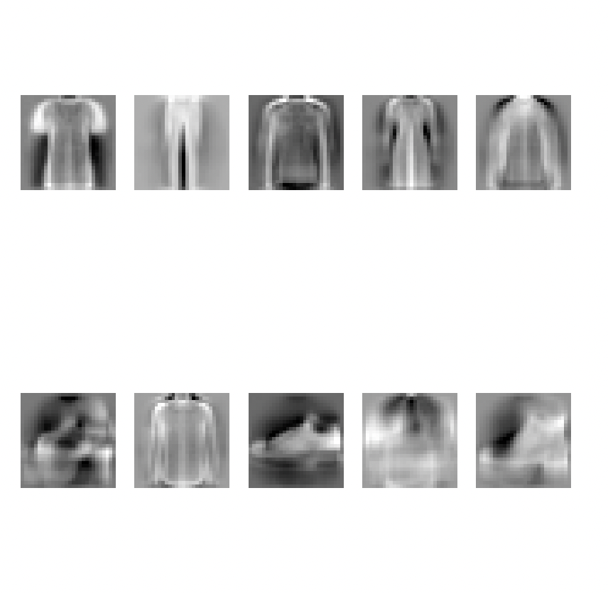

## Description
In this python program, I implemented softmax regression with cross entropy loss for multi class classification problem on fashion Mnist dataset.

Download testing and training data from the following links:
1. X_train: [https://s3.amazonaws.com/jrwprojects/fashion_mnist_train_images.npy](https://s3.amazonaws.com/jrwprojects/fashion_mnist_train_images.npy)
2. Y_train:[https://s3.amazonaws.com/jrwprojects/fashion_mnist_train_labels.npy](https://s3.amazonaws.com/jrwprojects/fashion_mnist_train_labels.npy)
3. X_test: [https://s3.amazonaws.com/jrwprojects/fashion_mnist_test_images.npy](https://s3.amazonaws.com/jrwprojects/fashion_mnist_test_images.npy)
4. Y_test: [https://s3.amazonaws.com/jrwprojects/fashion_mnist_test_labels.npy](https://s3.amazonaws.com/jrwprojects/fashion_mnist_test_labels.npy)

## Running the code
To run the code:
1. Download the dataset mentioned above into this directory
2. Install python3.5+, matplotlib and numpy.
3. Run the code python3 softmax_regression.py.

## Results
The code produces an accuracy of 75 to 80%. Below is the visualization of the template learned for each class in the dataset.

